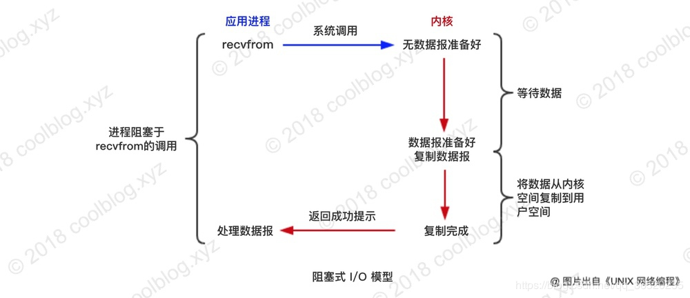
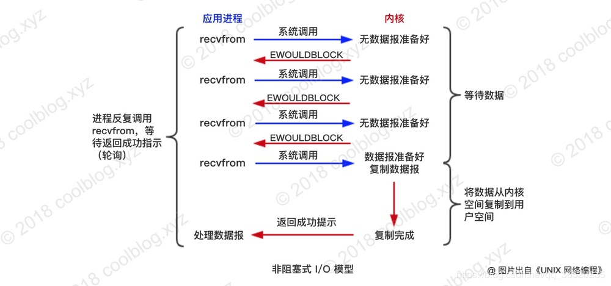
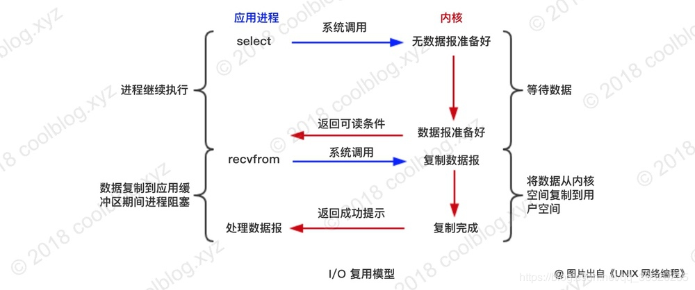
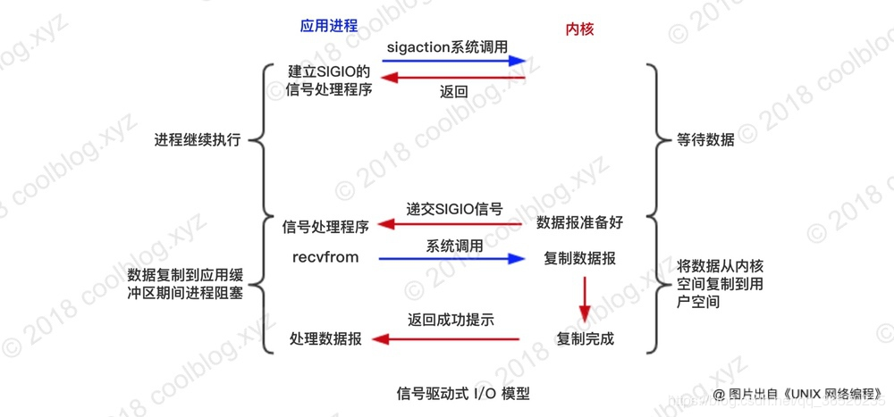
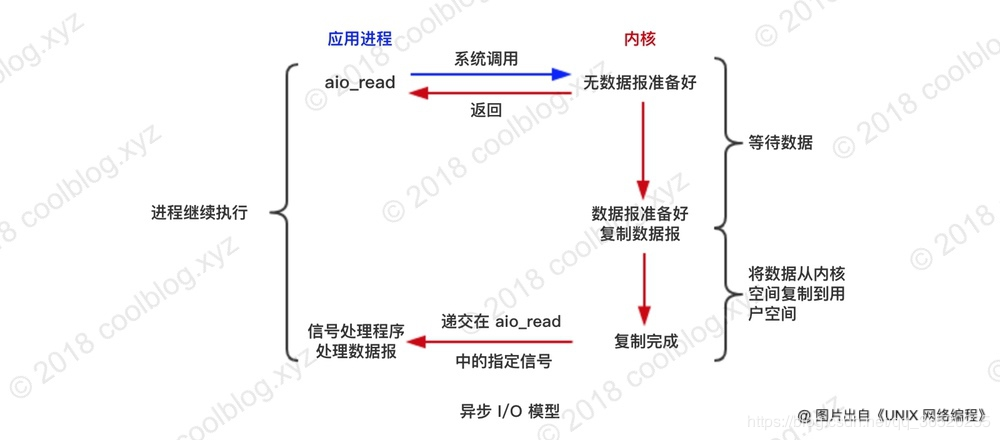

# IO

## IO模型的类型

### 1. 同步模型

1. 阻塞IO

其实就是当用户程序如果需要去进行IO操作的话，如果用户空间的应用程序执行一个系统调用（recvform），这会导致应用程序阻塞，什么也不干，直到数据准备好，并且将数据从内核复制到用户进程，最后进程再处理数据，在等待数据到处理数据的两个阶段，整个进程都被阻塞。不能处理别的网络IO

2. 非阻塞IO

如果请求的IO数据没有准备好的话，用户进程不会傻傻的在那死等数据准备好，而是直接返回。然后还得去不停的去询问内核是不是把数据准备好了（这个过程叫做轮询），直到内核准备好

3. 多路复用IO

通过把多个I/O的阻塞复用到同一个select的阻塞上，从而使得系统在单线程的情况下可以同时处理多个客户端请求，IO多路复用在阻塞到select阶段时，用户进程是主动等待并调用select函数获取数据就绪状态消息，并且其进程状态为阻塞

4. 信号驱动IO

信号驱动式 I/O 模型是指，应用进程告诉内核，如果某个 socket 的某个事件发生时，请向我发一个信号。在收到信号后，信号对应的处理函数会进行后续处理

### 2. 异步模型

首先我们允许Socket进行信号驱动IO,并安装一个信号处理函数，进程继续运行并不阻塞。当数据准备好时，进程会收到一个SIGIO信号，可以在信号处理函数中调用I/O操作函数处理数据

## 参考

[IO专题-----真实大厂面试题汇总](https://blog.csdn.net/qq_36520235/article/details/88689885)