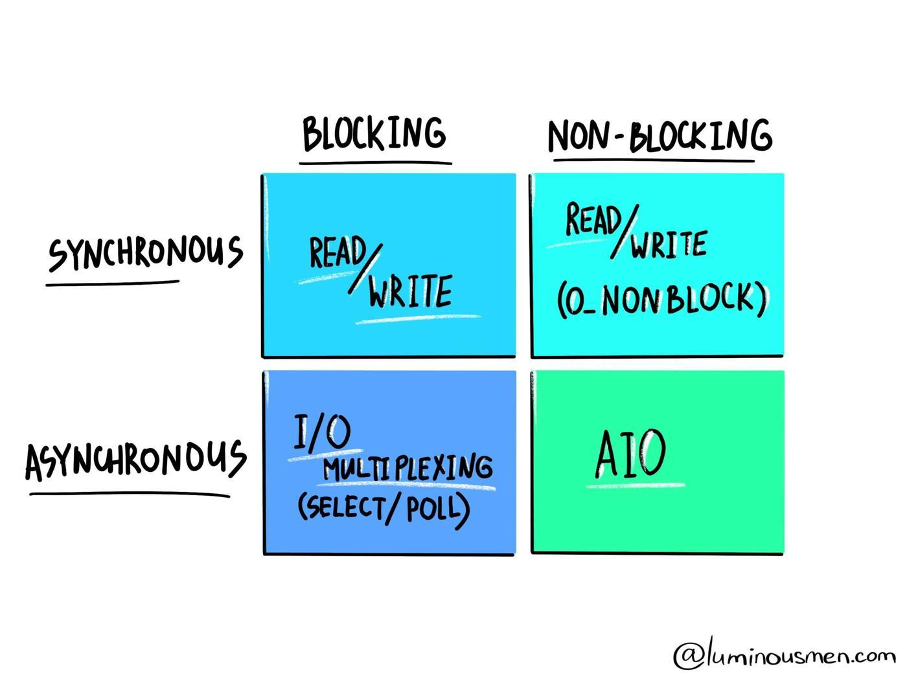

# 异步编程：阻塞IO和非阻塞IO

原文：[Asynchronous programming. Blocking I/O and non-blocking I/O](https://luminousmen.com/post/asynchronous-programming-blocking-and-non-blocking)


网络可以映射（map）为其他IO，比如将套接字替换为文件描述符。

当谈到阻塞和非阻塞调用的时候，大多数都是指处理IO。在现在的信息时代，最常见的情况是微服务和lambda functions处理请求。用户的请求会被服务商处理，确保你的请求满足。

在客户端和服务端之间进行交互，第一必须要建立连接，忽略网络协议的处理过程。


如果查看CPU和网络速度差很多，如果应用大部分时间都在使用IO，大多数情况下处理器都将是空闲，这种应用则被称为IO密集型应用。对于要求高性能的应用，IO则会是一个瓶颈。

有两种IO形式，阻塞和非阻塞。



每种IO模型都有特定的使用模式

## 阻塞IO

当客户端向服务端发出请求，套接字处理这个请求，相关线程则会读阻塞， 直到获取到数据。数据会放到网络缓冲中，直到所有数据读取，并准备好。直到操作完成，服务器只能等待。

最简单的结论便是：在一个线程中只能最多处理一个连接。TCP套接字默认是阻塞模式。

```python
import socket
import sys
import time


def main() -> None:
    host = socket.gethostname()
    port = 12345

    # create a TCP/IP socket
    with socket.socket(socket.AF_INET, socket.SOCK_STREAM) as sock:
        while True:
            sock.connect((host, port))
            while True:
                data = str.encode(sys.argv[1])
                sock.send(data)
                time.sleep(0.5)

if __name__ == "__main__":
    assert len(sys.argv) > 1, "Please provide message"
    main()
```

服务端：

```python
import socket


def main() -> None:
    host = socket.gethostname()
    port = 12345
    
    # create a TCP/IP socket
    with socket.socket(socket.AF_INET, socket.SOCK_STREAM) as sock:
        # bind the socket to the port
        sock.bind((host, port))
        # listen for incoming connections
        sock.listen(5)
        print("Server started...")

        while True:
            conn, addr = sock.accept()  # accepting the incoming connection, blocking
            print('Connected by ' + str(addr))
            while True:
                data = conn.recv(1024)  # receving data, blocking
                if not data: 
                    break
                print(data)

if __name__ == "__main__":
    main()
```


## 非阻塞

