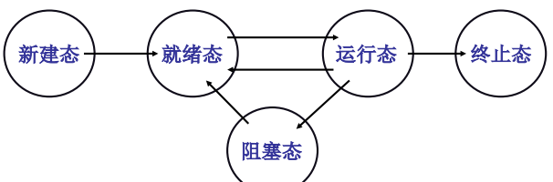
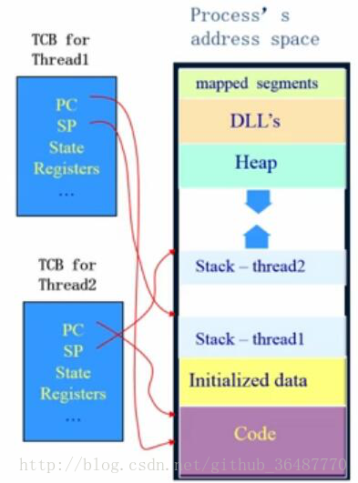
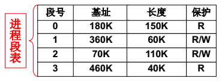
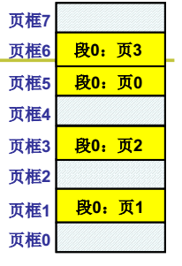
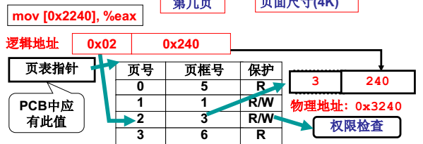
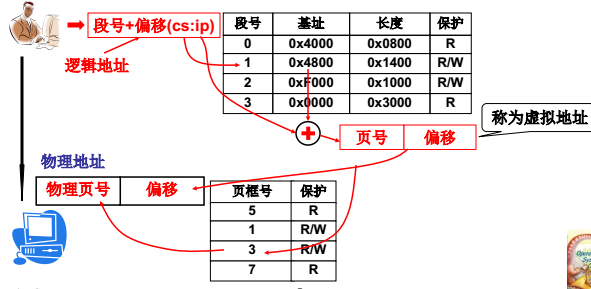
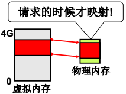
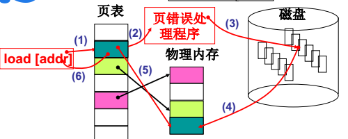

# 操作系统总结

原文：

[操作系统基础知识总结（重要）](https://www.cnblogs.com/xdyixia/p/9274909.html)

## 操作系统的四个特性

* 并发：同一个时间段内多个程序执行
* 共享：系统中的资源可以被内存多个并发执行的进程共同使用
* 虚拟：通过时分复用（如分时系统）以及空分复用（如虚拟内存）技术实现把一个物理实体虚拟为多个
* 异步：系统中的进程是以走走停停的方式执行的，且以一种不可预知的速度推进

## 继承与线程

### 多进程形式3个关键部分

1. PCB：用来记录进程信息的数据结构
2. 进程的状态：

3. 队列：就绪队列，阻塞队列

处于就绪状态的进程，在调度程序为之分配了处理机之后便开始执行， 就绪 -> 执行

正在执行的进程如果因为分配他的时间片已经用完，而被剥夺处理剂， 执行 -> 就绪

如果因为某种原因致使当前的进程执行受阻，使之不能执行。        执行 -> 阻塞

### CPU调度算法

* 周转时间：从开始申请执行任务，到执行任务完成

* 响应时间： 从开始申请执行任务到开始执行任务*

算法：

**先来先服务调度算法FCFS：**按作业或者进程到达的先后顺序依次调度；（平均周转时间可能会很长 ）

**短作业优先调度算法SJF：**算法从就绪队列中选择估计时间最短的作业进行处理，直到得出结果或者无法继续执行（周转时间短，但是响应时间长 ）

**高响应比算法HRN：**响应比=(等待时间+要求服务时间)/要求服务时间；

**时间片轮转调度RR：**按到达的先后对进程放入队列中，然后给队首进程分配CPU时间片，时间片用完之后计时器发出中断，暂停当前进程并将其放到队列尾部，循环 ;（响应时间可以得到保证）

**多级反馈队列调度算法：**目前公认较好的调度算法；设置多个就绪队列并为每个队列设置不同的优先级，第一个队列优先级最高，其余依次递减。优先级越高的队列分配的时间片越短，进程到达之后按FCFS放入第一个队列，如果调度执行后没有完成，那么放到第二个队列尾部等待调度，如果第二次调度仍然没有完成，放入第三队列尾部…。只有当前一个队列为空的时候才会去调度下一个队列的进程。

### 进程的分类

1. 僵尸进程：子进程结束，父进程没有明确的答复操作系统内核：已收到子进程结束的消息。此时操作系统内核会一直保存该子进程的部分PCB信息，同时将进程的状态置为defunct--->僵尸进程

2. 孤儿进程
3. 守护进程

### 线程

线程有自己的TCB（thread control block线程控制块）, 只负责这条流程的信息，包括PC程序计数器，SP栈，State状态，和寄存器，线程id。

### 进程和线程对比

进程是系统进行资源调度和分配的基本单位；线程是CPU调度的基本单位。

进程 = 资源 （包括寄存器值，PCB，内存映射表）+ TCB（栈结构）
线程 = TCB（栈结构）

线程 的资源是共享的
进程 间的资源是分隔独立的，内存映射表不同，占用物理内存地址是分隔的

线程 的切换只是切换PC，切换了TCB（栈结构）
进程 的切换不仅要切换PC，还包括切换资源，即切换内存映射表

### 进程通信

**https://www.cnblogs.com/xdyixia/p/9257668.html**

### 进程同步

经典的进程同步问题：生产者-消费者问题；哲学家进餐问题；读者-写者问题

同步的解决方案：管程，信号量。

死锁的定义：

在两个或多个并发进程中，如果每个进程持有某种资源而又都等待别的进程释放它或它们现在保持着的资源，在未改变这种状态之前都不能向前推进，称这一组进程产生了死锁。通俗地讲，就是两个或多个进程被无限期地阻塞、相互等待的一种状态。

产生的条件：

1. 互斥条件     -- 一个资源一次只能被一个进程使用

2. 请求保持条件 -- 一个进程因请求资源而阻塞时，对已经获得资源保持不放 

3. 不可抢占条件 -- 进程已获得的资源在未使用完之前不能强行剥夺

4. 循环等待条件 -- 若干进程之间形成一种头尾相接的循环等待资源的关系 

死锁处理：

1. 预防死锁：破坏产生死锁的4个必要条件中的一个或者多个；实现起来比较简单，但是如果限制过于严格会降低系统资源利用率以及吞吐量
2. 避免死锁：在资源的动态分配中，防止系统进入不安全状态(可能产生死锁的状态)-如银行家算法
3. 检测死锁：允许系统运行过程中产生死锁，在死锁发生之后，采用一定的算法进行检测，并确定与死锁相关的资源和进程，采取相关方法清除检测到的死锁。实现难度大
4. 解除死锁：与死锁检测配合，将系统从死锁中解脱出来（撤销进程或者剥夺资源）。对检测到的和死锁相关的进程以及资源，通过撤销或者挂起的方式，释放一些资源并将其分配给处于阻塞状态的进程，使其转变为就绪态。实现难度大

## 内存管理

**要解决的两个问题**

1. 每个进程代码中使用的地址可能相同。解决思路：对代码中的地址重定向（加个基地址）。

2. 物理内存可能比较小，不能同时放很多进程进来。解决思路：把要运行的代码移到内存，暂时不用的代码移入磁盘，即交换（swap），内存置换

### 分段

一个程序分成多个段（每个段特性不同为了方便管理，例如代码段只读、数据段等等），当然这都是逻辑上的。

管理段的结构叫段表，段表保存中进程的PCB中。

### 页表

把程序按段分对程序员是友好的，但是如果物理存储也按段存，则会导致大块的内存碎片，例如现在需要分个10M的段但是连续的存储空间只有8M/9M/5M三个。**解决办法：** （将段打散存到页中）不要对内存进行连续的分配，将内存划分成1页1页，按页分配，1页4kb大小，最多浪费的也就4KB。这样不会有内存碎片，也不会出现没有符合要求大小的内存可以申请的情况，因为可以打散了分散到一页一页中。 

### 段页结合内存管理

**实际在内存管理中的段页结合如下图，页号加偏移称为虚拟地址，MMU负载从虚拟地址到物理地址的转换，同时也负责权限检查。**

上面解决了**每个进程代码中使用的地址可能相同，系统给每个进程分配基地址，进程保存在PCB中。**

**但是进程可操作的虚拟地址为4G（32位系统），可物理地址为1G怎么办。**

### 请求调页内存换入

**CPU对数据进行请求时，才会进行映射（虚拟内存到物理内存）。**

**例如进程1正在运行，进行映射拿数据，查页表发现页框号中没有数据或有进程2的数据，则需要页表调入内存。**

### 内存换出

页面置换算法

1. **最佳置换算法 **一种理论的算法，选着淘汰的页面是以后一定不再使用的页面（理想化的），该算法无法实现，只能作为其他算法好坏的一个评价对比。
2. **先进先出（FIFO）算法** 总是最先淘汰最先进去的页面，该算法容易实现。缺点：通常程序调入内存的先后顺序和程序执行的先后顺序不一致，导致缺页率高
3. **最近最久未使用算法LRU** 算法赋予每个页面一个访问字段，用来记录上次页面被访问到现在所经历的时间t，每次置换的时候把t值最大的页面置换出去(实现方面可以采用寄存器或者栈的方式实现)。
4. **时钟算法clock(也被称为是最近未使用算法NRU)** 页面设置一个访问位R，并将页面链接为一个环形队列，页面被访问的时候访问位设置R为1。页面置换的时候，如果当前指针所指页面访问R为0，那么置换，否则将其置为0，循环直到遇到一个访问为位0的页面。

