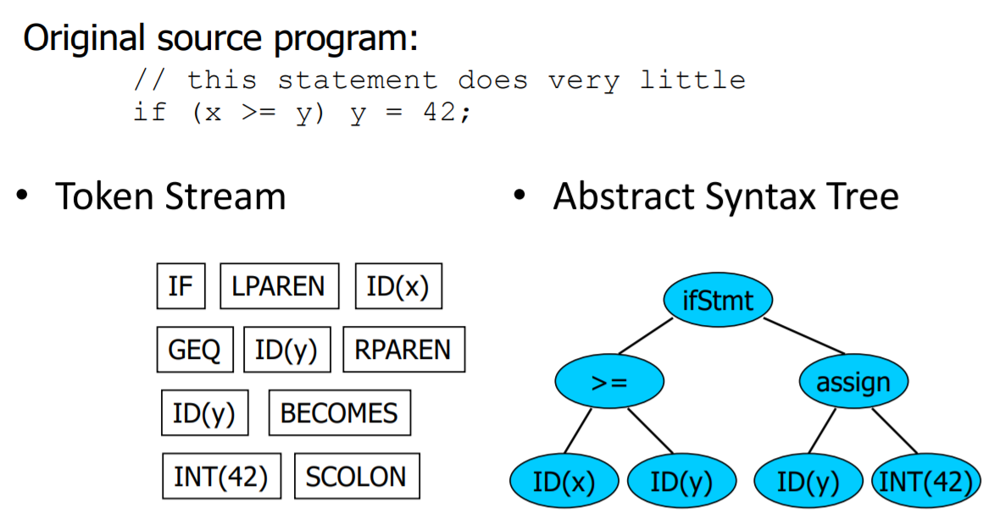
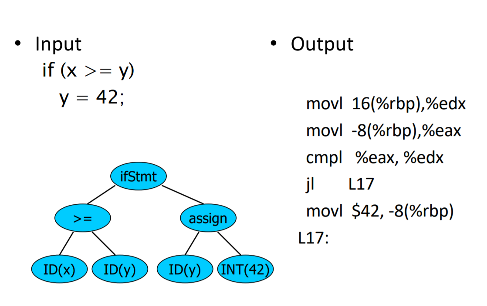
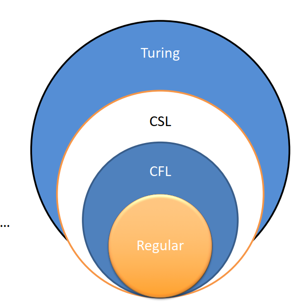

# 编译器课程

## 华盛顿大学CSE401

相似的课程：

* UW CSE 401
* UW CSE 582/501
* Rice CS 412
* Cornell CS 412-3
* 书：Appel; Cooper/Torczon; Aho, [[Lam,] Sethi,] Ullman [Dragon Book]; Fischer, [Cytron ,] LeBlanc; Muchnick, …

前置课程：

* CSE 332
* CSE 351

非必须但有用：

*  	CSE 331
* CSE 341

## Overview

如何执行下面的代码

```java
int nPos = 0;
int k = 0;
while (k < length) {
	if (a[k] > 0) {
		nPos++;
	}
}
```

计算机只知道1和0

### 编译器的结构

at a high level

编译器有两部分：

前端：分析

* 读取源码文件并扫描结构和意义

后端：生成代码

* 生成系统语义的目标机器代码

### 编译器应当

* 识别合法的程序（对错误的部分进行提示）
* 生成正确的代码
  * 编译器能够尝试优化代码，但不能改变原来代码的结果
* 管理运行时的参数和数据的存储
* Agree with OS & linker on target format

### Implications

在编译期间会使用几种中间语义（Intermediate Representation）

* 前端将源码映射为IR
* 后端将IR映射为机器码
  * 经常会有多个IR-首先是高层的，在后面的阶段是底层

### 前端

前端经常分为两部分：

* 扫描器 将字符流转换为token流：关键字，操作符，参数，常量。同时去掉空白格和注释。
* 解析器 读取Token流将其转换成IR，在这个阶段或者在后面进行语义分析检测是否错误比如类型错误

这些都可以自动生成

### 扫描器的例子

* 输入文本

```java
// this statement does very little
if (x >= y) y = 42;
```

* Token流

IF LPAREN ID(x) GEQ ID(y) RPAREN ID(y) BECOMES INT(42) SCOLON

注意：token是原子，不是字符串。注释和空白格（(in most languages – counterexamples: Python indenting, Ruby and JavaScript newlines）

token有时会携带关联的数据

### 解析输出（IR）

* 通过接收扫描器的token流，解析器应当produce output that captures the meaning of the program
* 大多数解析器的输出是一个抽象语法树
  * 屏蔽了句法干扰的程序的关键信息
  * 节点是操作符，孩子节点是操作树

* 许多不同的形式
  * Engineering tradeoffs change over time
  * Tradeoffs (and IRs) can also vary between different phases of a single compiler

### 例子

​	

### 静态语法分析

在解析过程中或者解析过程后（通常），检测程序是否合法，为后端收集信息

* 类型检查
* 验证语言要求像正确的声明
* 初步分配资源
* 收集其他的后端分析和代码生成需要的信息

关键的数据结构：符号表（Symbol Tables）

* –Maps names -> meaning/types/details

### 后端

职责

* 将IR翻译成目标代码
* 应当生成好的代码（fast, compact, low power ）
* 应当有效使用机器资源
  * 寄存器
  * 指令
  * 各级存储器

### 后端结构

通常来说有两个主要的部分：

* 优化 代码改进，将正确的代码变为相同的更有效的代码
* 目标代码的生成（面向机器的）

通常是遍历抽象语法树和生成底层代码而后优化

####  结构



### 为何学习编译器

**成为一个更好的程序员**

* 深刻理解语言、编译器、硬件之间的交互
* 理解技术的实现，代码怎么映射到硬件上
* 更好的感知你的代码做什么
* 理解编译器如何优化代码帮助写出更易于优化的代码

**编译器的技术存在于各种地方**

* 解析器
* 软件工具
* 数据库引擎，查询语言
* 领域特定语言
* 文本解析
* 硬件
* 数学

可以很好的结合理论和工程

* 有很多关于编译器的优秀理论
  * 解析，扫描，静态分析
* 有趣的工程挑战和tradeoff，特别是优化
* 并有一些非常困难的问题

Draws ideas from many parts of CSE 

– AI: Greedy algorithms, heuristic search 

– Algorithms: graphs, dynamic programming, approximation 

– Theory: Grammars, DFAs and PDAs, pattern matching, fixed-point algorithms 

– Systems: Allocation & naming, synchronization, locality 

– Architecture: pipelines, instruction set use, memory hierarchy management, locality

### Languages, Automata, Regular Expressions & Scanners

#### 形式语言与自动机理论

* 字母：一个符号和字母的有限集合
* 字符串：一个有限的，可空的字母序列
* 语言：一组字符串（可能无限或者空）
* Finite specifications of  languages
  * 自动机：a recognizer; a machine that accepts all strings in a language
  * Grammar-a generator; a system for producing all strings in the language
* 一个语言由许多不同的自动机和语法规定

#### 语言（乔姆斯基）层次结构

* type-3：正则语言由正则表达式和有限自动机规定
* type-2：上下文无关语言有上下文无关语法和下推自动机规定
* type-1：上下文相关语言
* type-0：递归可枚举语言由通用语法和图灵机规定



